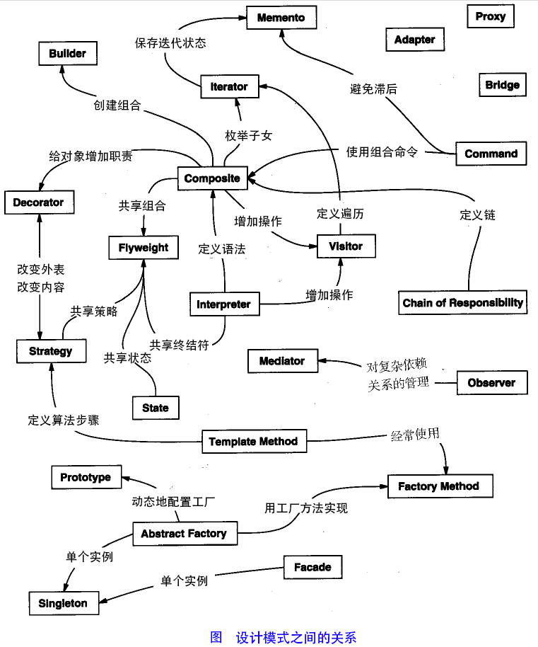

#设计模式(Design Pattern)

设计模式的出现是基于一些问题的，例如代码无法复用性差，可维护性差等等。 设计模式可以很好的的解决这些问题，并且让我们的代码有较强的可读性。。

设计模式有几个设计原则（有的地方说6个，有的地方8个，有的还有3个，我就把这几个原则都拎出来看看）：
1. 单一职责原则（单一原则、单一功能原则）
每个类都应该只实现单一的功能，否则这个类就会显得很臃肿，复用性、维护性都比较差
2. 开闭原则
对扩展开放，对修改关闭。抽象约束，封装变化。如果需要扩展功能，可以使用接口或抽象类，只需要重写其中的方法就行，而不是在原有方法的基础上修改。
3. 里氏替换原则
里式替换原则是对开闭原则的进一步补充，开闭原则意思是可以抽取抽象的方法，里式替换原则是指在子类继承父类时，除添加新的方法完成扩展功能外，尽量不要重写父类的方法。即子类可以扩展父类的功能，但不能改变父类原有的功能。
4. 依赖倒置原则
在软件设计中，细节具有多变性，而抽象则相对稳定，因此细节应该依赖抽象，抽象不应该依赖细节。这里的抽象指的是接口或者抽象类，而细节是指具体的实现类。依赖倒置原则要求尽量每个类都提供接口或抽象类，或者两者都具备。
5. 接口隔离原则
有点类似单一职责原则，但是单一职责原则体现的是职责单一，接口隔离原则是从接口依赖的层面要求的是各个类应该建立专用的接口,接口应该细颗粒化，只服务于一个子模块或业务逻辑。
6. 迪米特原则（最少知识原则）
它主要是为了降低耦合，认为一个类应该尽量少与其他类发生联系，被其他类知道的越少，耦合度越低，可以提高功能模块之间的独立性。 
7. 合成复用原则
优先使用对象组合，而不是类继承的方式。我以前可喜欢用继承了，有时候继承确实用起来很方便，但是也有重复考虑系统功能的扩展和可读性才行。继承从某种程度上破坏了封装性，父子类耦合度高。
8. 针对接口编程，而不是针对实现编程
面向接口编程，意思是我只关注这个某些对象特性的接口能不能用，不关注这些对象特性下的具体类型是啥。比如轮胎在转动这个方法，我只关注你有轮胎就行了，不在乎你是什么型号的轮胎。

以下参考[菜鸟教程的设计模式](https://www.runoob.com/design-pattern/design-pattern-intro.html) 

设计模式，一共有23种设计模式。可以分为创建型、行为型、结构型三大类。

##一、创建型模式（Creational Patterns）——5种

###1、单例模式（Singleton Pattern）

这种模式涉及到一个单一的类，该类负责创建自己的对象，同时确保只有单个对象被创建。这个类提供了一种访问其唯一的对象的方式，可以直接访问，不需要实例化该类的对象。

> 注意：
>> 1. 单例类只能有一个实例。
>> 2. 单例类必须自己创建自己的唯一实例。
>> 3. 单例类必须给所有其他对象提供这一实例。

**介绍**

意图：
> 保证一个类仅有一个实例，并提供一个访问它的全局访问点。

主要解决：
> 一个全局使用的类频繁地创建与销毁。

何时使用：
> 当您想控制实例数目，节省系统资源的时候。

如何解决：
> 判断系统是否已经有这个单例，如果有则返回，如果没有则创建。

关键代码：
> 构造函数是私有的。

应用实例：

>1、一个班级只有一个班主任。 
> 
> 2、Windows 是多进程多线程的，在操作一个文件的时候，就不可避免地出现多个进程或线程同时操作一个文件的现象，所以所有文件的处理必须通过唯一的实例来进行。 
>
> 3、一些设备管理器常常设计为单例模式，比如一个电脑有两台打印机，在输出的时候就要处理不能两台打印机打印同一个文件。

优点：

> 1、在内存里只有一个实例，减少了内存的开销，尤其是频繁的创建和销毁实例（比如管理学院首页页面缓存）。
> 
> 2、避免对资源的多重占用（比如写文件操作）。

缺点：
> 没有接口，不能继承，与单一职责原则冲突，一个类应该只关心内部逻辑，而不关心外面怎么样来实例化。

使用场景：
> 1、要求生产唯一序列号。 
> 
> 2、WEB 中的计数器，不用每次刷新都在数据库里加一次，用单例先缓存起来。 
> 
> 3、创建的一个对象需要消耗的资源过多，比如 I/O 与数据库的连接等。

注意事项：
> getInstance() 方法中需要使用同步锁 synchronized (Singleton.class) 防止多线程同时进入造成 instance 被多次实例化。

单例中三种懒汉式不推荐，存在线程安全问题，同步方法的方式解决了线程的问题，但是性能极差
单例中两种饿汉式可用，但是存在性能问题
最后三种单例模式值得推荐。

####1-1、懒汉式(线程不安全,仅适应于单线程工作)
####1-2、懒汉式(线程安全，同步方法)
####1-3、懒汉式(线程安全，同步代码块)
####1-4、饿汉式(静态常量)
####1-5、饿汉式（静态代码块）
####1-6、双重检查
####1-7、静态内部类
####1-8、枚举
###2、工厂模式（Factory Pattern）
工厂模式比较常用，用工厂方法代替new对象的操作。当我们知道我们在不同的条件下会创建不同的实例的情况下，可以使用工厂模式。
####2-1、简单工厂模式（Simple Factory Pattern）
####2-2、工厂方法模式（Factory Method Pattern）
###3、抽象工厂模式（Abstract Factory Pattern）
###4、原型模式（Prototype Pattern）
###5、建造者模式（Builder Pattern）

##二、结构型模式（Structural Patterns）7种还是8种？
- 适配器模式（Adapter Pattern）
- 桥接模式（Bridge Pattern）
- 装饰者模式（Decorator Pattern）
- 外观模式（Facade Pattern）
- 代理模式（Proxy Pattern）
- 组合模式（Composite Pattern）
- 享元模式（Flyweight Pattern）
- 过滤器模式（Filter、Criteria Pattern）？有没有

##三、行为型模式（Behavioral Patterns）11种还是12种
- 策略模式（Strategy Pattern）
- 状态模式（State Pattern）
- 责任链模式（Chain of Responsibility Pattern）
- 观察者模式（Observer Pattern）
- 模板模式（Template Pattern）
- 迭代器模式（Iterator Pattern）
- 备忘录模式（Memento Pattern）
- 访问者模式（Visitor Pattern）
- 中介者模式（Mediator Pattern）
- 解释器模式（Interpreter Pattern）
- 命令模式（Command Pattern）
- 空对象模式（Null Object Pattern）?有没有
